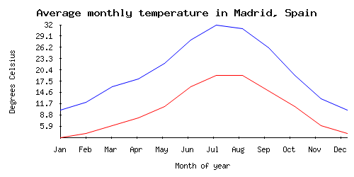

# plotta

[![Latest Version on Packagist][ico-version]][link-packagist]
[![Software License][ico-license]](LICENSE.md)
[![Build Status][ico-travis]][link-travis]
[![Coverage Status][ico-scrutinizer]][link-scrutinizer]
[![Quality Score][ico-code-quality]][link-code-quality]
[![Total Downloads][ico-downloads]][link-downloads]

A very simple PHP library to create static charts.

## Install

Via Composer

``` bash
$ composer require carlosafonso/plotta
```

## Usage

``` php
$builder = new PlotBuilder();
$builder
    ->withDimensions(500, 250)
    ->withTitle('Average monthly temperature in Madrid, Spain')
    ->withXAxis(new XAxisConfig('Month of year', ['Jan', 'Feb', 'Mar', 'Apr', 'May', 'Jun', 'Jul', 'Aug', 'Sep', 'Oct', 'Nov', 'Dec']))
    ->withYAxis(new YAxisConfig('Degrees Celsius'))
    ->withData([10,12,16,18,22,28,32,31,26,19,13,10])
    ->withData([3,4,6,8,11,16,19,19,15,11,6,4])
    ->render('/path/to/chart.png');
```

This will produce a chart like the following one:



## Security

If you discover any security related issues, please email the author instead of using the issue tracker.

## Credits

- [Carlos Afonso][link-author]
- [All Contributors][link-contributors]

## License

The MIT License (MIT). Please see [License File](LICENSE.md) for more information.

[ico-version]: https://img.shields.io/packagist/v/carlosafonso/plotta.svg?style=flat-square
[ico-license]: https://img.shields.io/badge/license-MIT-brightgreen.svg?style=flat-square
[ico-travis]: https://img.shields.io/travis/carlosafonso/plotta/master.svg?style=flat-square
[ico-scrutinizer]: https://img.shields.io/scrutinizer/coverage/g/carlosafonso/plotta.svg?style=flat-square
[ico-code-quality]: https://img.shields.io/scrutinizer/g/carlosafonso/plotta.svg?style=flat-square
[ico-downloads]: https://img.shields.io/packagist/dt/carlosafonso/plotta.svg?style=flat-square

[link-packagist]: https://packagist.org/packages/carlosafonso/plotta
[link-travis]: https://travis-ci.org/carlosafonso/plotta
[link-scrutinizer]: https://scrutinizer-ci.com/g/carlosafonso/plotta/code-structure
[link-code-quality]: https://scrutinizer-ci.com/g/carlosafonso/plotta
[link-downloads]: https://packagist.org/packages/carlosafonso/plotta
[link-author]: https://github.com/carlosafonso
[link-contributors]: ../../contributors
